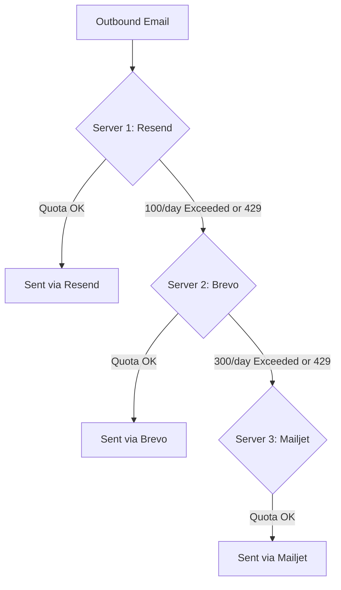

## The 24k Free Email Strategy

Most modern developer email providers offer generous daily or monthly free tiers intended for individual projects. However, a single provider's free limit (such as 100/day) is often too small for a growing SaaS application.

Email Connector unifies these disjointed limits into a single, seamless, self-healing sending pool.

---

## Detailed Quota Math

```
  Provider          Daily Limit       Monthly Calculation
  ────────────────────────────────────────────────────────
  Brevo             300 / day         300 × 30 = 9,000
  Mailjet           200 / day         200 × 30 = 6,000
  Resend            100 / day         100 × 30 = 3,000
  MailerSend        100 / day         100 × 30 = 3,000
  Twilio SendGrid   100 / day         100 × 30 = 3,000
  ────────────────────────────────────────────────────────
  TOTAL POOL        800 / day         24,000 / month
```

### Monthly Cost Comparison

| Email Volume | Stacking with Email Connector | Single Commercial ESP (Paid Plan) |
| :---: | :---: | :---: |
| **5,000 / mo** | **$0.00 / mo** | ~$20.00 / mo |
| **15,000 / mo** | **$0.00 / mo** | ~$35.00 / mo |
| **24,000 / mo** | **$0.00 / mo** | ~$55.00 / mo |
| **100,000 / mo** | **$10.00 / mo** *(via AWS SES)* | ~$90.00 / mo |

---

## Cascade & Failover Behavior

The `ZeroTrustBalancer` implements a multi-tier dispatch priority:

1. **Daily Limit Enforced:** When `sentToday >= dailyLimit`, the balancer marks the server exhausted for the remainder of the calendar day (UTC) and shifts to the next priority server.
2. **Rate Limit Recovery (HTTP 429):** If an ESP returns 429 Too Many Requests, the server enters a temporary backoff cooldown (default 5 minutes) and dispatches the current email to the next priority server immediately.
3. **Midnight Reset:** At `00:00:00 UTC`, daily counters reset automatically.


